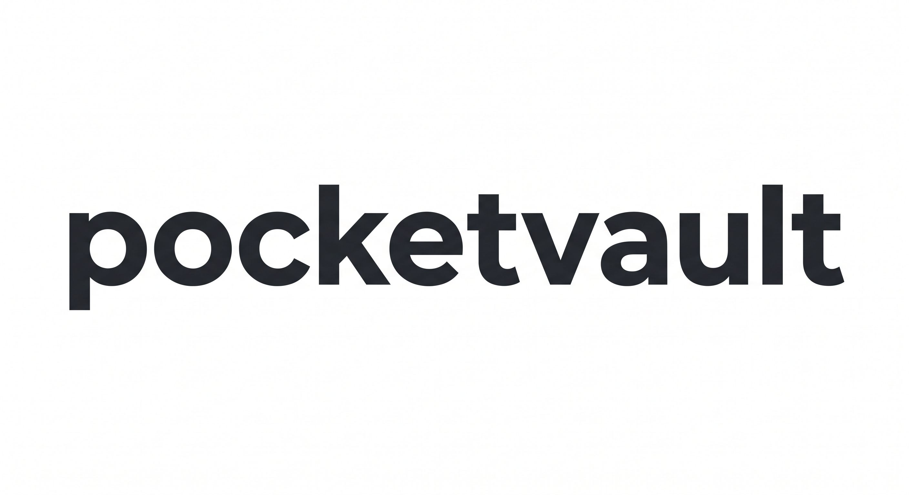
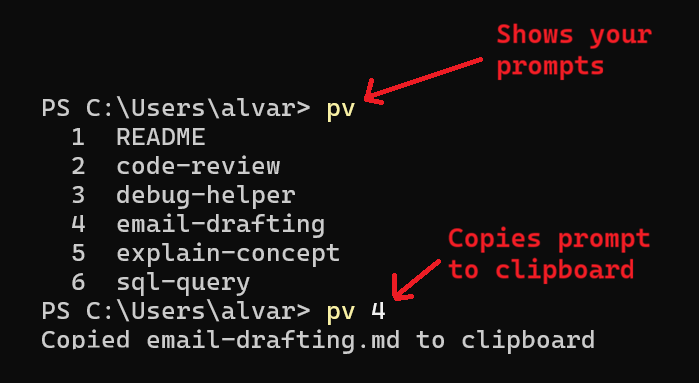

<p align="center">
  
</p>

<p align="center">
  <em>A Python CLI for managing your LLM prompts, stored as <code>.md</code> files in a private git repo.</em>
  <br>
  <em>That's the whole thing.</em>
</p>

<p align="center">
  
</p>

<p align="center">
  <code>pv</code> lists your prompts. <code>pv &lt;number&gt;</code> copies one to your clipboard. You paste it into any LLM.
</p>

<p align="center">
  <a href="https://pypi.org/project/pocket-vault/"></a>
  <a href="https://github.com/DKeAlvaro/pocket-vault/blob/main/LICENSE"></a>
  <a href="https://github.com/DKeAlvaro/pocket-vault"></a>
</p>

---

**It's open source on GitHub and PyPI.** The vault is a git repo you own. If the tool stops being maintained tomorrow, you still have a folder of text files and a few hundred lines of Python you can read, fork, or replace. Nothing proprietary holds your data.

**Everything is transparent.** You see your prompts as plain files. You see exactly what you're about to paste. You decide what enters the LLM's context. There's no hidden system injecting instructions, no agent-specific config, no opaque skill loading. The file is the prompt. The paste is the paste.

**Nothing is bolted on.** No MCP server, no plugin architecture, no SaaS, no API key, no account. Pocket Vault is a CLI, a git repo, and `.md` files, three primitives that have been around for decades and will outlive any platform shift. Your prompts survive because they were never locked into one.

## Quick start

```bash
pip install pocket-vault
pv auth
```

Full reference: [Technical Guide](https://github.com/DKeAlvaro/pocket-vault/blob/main/src/README.md)
